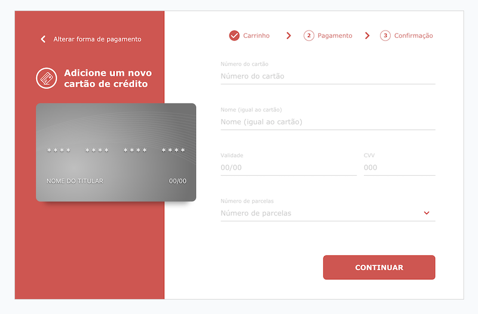

# Checkout Form

[](https://lbesson.mit-license.org/)

Checkout component built with React, Tailwind, Formik and CSS 3D Transforms




## Prerequisites

- [Node](https://nodejs.org/en/)
- [yarn](https://classic.yarnpkg.com/)

## Getting started

1. Clone the project

```shell
$ git clone https://github.com/gustavomonjardim/checkout-form.git
```

2. Install the dependencies:

```shell
$ yarn
```

3. Run the project

```shell
$ yarn start
```

4. Generating a production build

```shell
$ yarn build
```

## Technologies

- Built with [Create React App](https://github.com/facebook/create-react-app) and [React](https://github.com/facebook/react).
- Uses [Tailwind CSS](https://tailwindcss.com/) for styling.
- Uses [Formik](https://github.com/jaredpalmer/formik) and [Yup](https://github.com/jquense/yup) for building and validating forms.

## Testing

You can run tests with the following command:

```shell
$ yarn test
```

## To do

- Add environment variables to set the request time of the API and the total value of the purchase.
- Build the UI for the Bag and Confirmation steps.
- Add support to all card brands besides Visa.

## License

Licensed under the [MIT License](./LICENSE).

